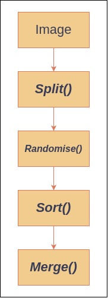

# 📶 Sort Image

Inspiration for this project is the following post from [Reddit](https://www.reddit.com/r/ProgrammerHumor/comments/cyrlvp/learn_sorting_algorithm_with_kronk/).

## 👷 Architecture

This is the flow of data, `PIL` is used to manipulate images and `ffmpeg` to
combine image sources into one single video.



## ⚙️ Usage

Install `ffmpeg`.

```sh
sudo apt install ffmpeg
```

```sh
git clone <https://github.com/surajkareppagol/sort-image>
cd sort-image
```

```sh
python3 -m venv .venv
source .venv/bin/activate
```

```sh
pip install -r requirements.txt
```

```sh
python3 src/main.py sunset.jpg
```

Change `sunset.jpg` with the image.

```sh
python3 src/main.py sunset.jpg -s 100
```

Split size can be provided as command line argument.

```sh
python3 src/main.py sunset.jpg -s 100 -a 0
```

Change sorting algorithm with algorithm index. Here `0` is for `Bubble Sort`.

## 📶 Sorting Algorithms

> Only Bubble sort is available in this current implementation.

- Bubble Sort ✅
